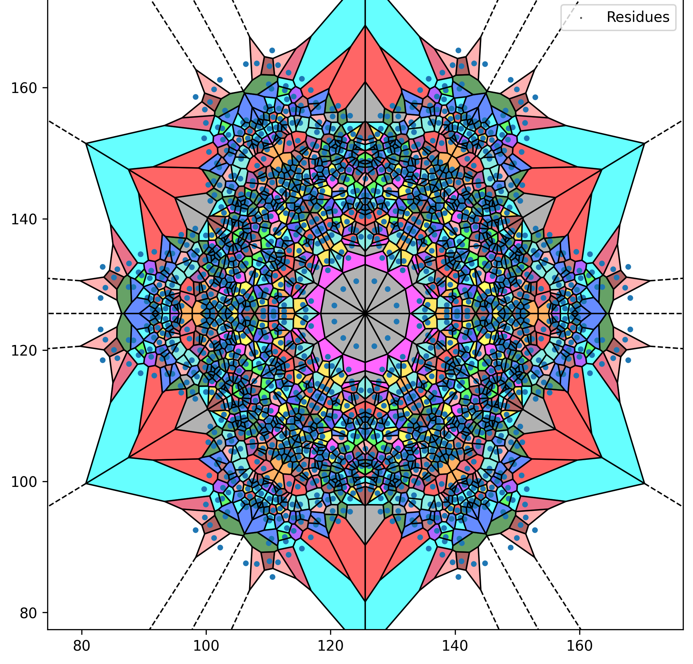

# Protein Classification Project

This repository contains code and data pipelines for training and evaluating deep learning models on immunogenicity classification tasks using protein sequences and structure-derived features.

---

## Project Overview

The identification of protective immunogens is a critical initial step in vaccine design and therapeutic protein discovery. Traditional methods often rely on laborious in vivo testing; however, machine learning and structural biology offer scalable alternatives. This project builds upon the principle that both amino acid sequence and 3D structural information influence a protein's immunogenicity.

We utilize:

* **Structural modeling** using Voronoi diagrams of protein surfaces
* **One-hot encoded primary sequences**
* **Graph-based models on 3D structures**
* **CNNs on image-like Voronoi projections**
* **Transformers on sequences**
* **Hybrid CNN-Transformer architectures**

### Dataset Sources

Datasets were derived from the VaxiJen v3.0 server and curated according to the protocols described in the study:

* **Dimitrov et al., "Bacterial Immunogenicity Prediction by Machine Learning Methods"**, Vaccines 2020, [link](https://www.ddg-pharmfac.net/vaxijen3/)
  The dataset includes:

  * 317 immunogenic bacterial proteins
  * 317 non-immunogenic bacterial proteins
  * All sequence and structure data were retrieved from NCBI and UniProtKB databases

For tumor immunogens, data were compiled from manually labeled sequences cross-referenced with known epitopes and cancer-related antigen lists.

---

## Repository Structure

```bash
.
├── Saliency_maps.ipynb                   # Generates saliency visualizations for CNN/Transformer models
├── main.ipynb                            # Full training pipeline for hybrid model
├── architectures/                        # All neural network architectures
│   ├── benchmark_ResNet18.py             # ResNet18 baseline (binary)
│   ├── benchmark_ResNet18_multiclass.py  # ResNet18 for multiclass
│   ├── cnn.py                            # CNN model for binary image classification
│   ├── cnn_multiclass.py                 # CNN for multiclass classification
│   ├── cnn_transformer_modules.py        # Data loaders, training utilities, and constants
│   ├── gnn_model.py                      # GNN using PDB-derived graph features
│   ├── gnn2_model.py                     # Enhanced GNN with GAT/GCN layers
│   ├── hybrid_cnn_transformer.py         # CNN + Transformer fusion for multimodal input
│   └── saved_models/                     # Trained weights (e.g., resnet18_multiclass.pth)
├── data_preprocessing/                   # Jupyter notebooks to generate sequence + structure features
│   ├── Encoded-Sequence.ipynb            # One-hot encoding for sequences
│   ├── PDB extraction.ipynb              # Chain and residue extraction from PDB
│   ├── data_augmentation.ipynb           # Augment images (rotations, flips, etc.)
│   └── bacterial_dataset_antigens/       # Folder for extracted images and pdb files
├── datasets/                             # Final datasets used in training
│   ├── binary_dataset/                   # For binary classification tasks
│   ├── data_augmented_multiclass_dataset/ # With augmented image samples
│   ├── multiclass_dataset/               # Used for 4-class classification
│   └── original_datasets/                # Raw image and sequence data organized per class
├── output_folder/                        # HTMLs for saliency visualization comparisons
├── missing_csv_log.txt                   # Log of missing CSVs (i.e., image without matching sequence)
└── project_tree.txt                      # File tree for the repository
```

---

## Model Architectures

### CNNs

* `cnn.py`: Standard CNN model for binary classification
* `cnn_multiclass.py`: Adapted CNN for 4-class tasks using protein Voronoi images

### ResNet18

* `benchmark_ResNet18.py`: Transfer learning on ResNet18 for binary classification
* `benchmark_ResNet18_multiclass.py`: Multiclass adaptation of ResNet18 using final FC layer

### CNN + Transformer

* `hybrid_cnn_transformer.py`: Contains `CNNTransformerNet` that merges sequence and image features; defines dataset `HybridProteinDataset`
* `cnn_transformer_modules.py`: Modular utilities for training, evaluation, and loading. Includes:

  * Data loaders: `ImageOnlyDataset`, `SequenceOnlyDataset`
  * Utilities: `train_model()`, `evaluate_model()`, `get_max_seq_length()`
  * Constants: `AA_CODES`, `AA_TO_INDEX`, `NUM_FEATURES`

### Graph Neural Networks

* `gnn_model.py`: Basic GCN-based classifier leveraging adjacency matrices built from 3D residue contacts
* `gnn2_model.py`: Advanced GNN model using Graph Attention Networks (GAT) and multi-layered aggregation

---

## Training & Evaluation

* `main.ipynb`: Full training routine using the hybrid CNN-Transformer
* `cnn_transformer_modules.py`: Training functions shared across architectures
* `Saliency_maps.ipynb`: Produces heatmaps to visualize saliency across structure and sequence

---

## How to Run

```bash
python main.py
```

Ensure the data folders follow this layout:

* `datasets/original_datasets/{class_name}/voronoi_images/*.png`
* `datasets/original_datasets/{class_name}/onehot_sequences/*.csv`

---

## Data Format

Each class folder contains:

* `voronoi_images/`: PNG images from protein surface projections
* `onehot_sequences/`: CSVs with one-hot encoded amino acid sequences

Supported classes:

* `tumor_antigens_immunogenic`
* `tumor_antigens_non-immunogenic`
* `bacterial_antigens`
* `bacterial_non_antigens`

---

## Outputs

* `.html` visualizations in `output_folder/` for saliency comparisons using py3Dmol
* `.pth` model weights in `architectures/saved_models/`
* Accuracy/loss curves exported during training
* Saliency overlays: generated Voronoi diagrams with heatmap blending

### Sample Visualizations

| Voronoi Projection              | 3D Saliency Overlay                                       |
| ------------------------------- | --------------------------------------------------------- |
|  | [View Saliency](3D_Saliency_Example.png) |

> Open the HTML files in a web browser to interactively rotate and inspect the highlighted saliency regions.

---

## References & Background

* Marco A. Benavides, "Graph Neural Networks for Immunogenicity Prediction Using Voronoi-Based Protein Representations"
* Dimitrov et al., *Bacterial Immunogenicity Prediction by Machine Learning Methods*, Vaccines 2020, 8, 709. [https://www.mdpi.com/2076-393X/8/4/709](https://www.mdpi.com/2076-393X/8/4/709)
* VaxiJen dataset v3.0: [https://www.ddg-pharmfac.net/vaxijen3/](https://www.ddg-pharmfac.net/vaxijen3/)
* BionoiNet: Öztürk et al., 2021
* AlphaFold: Jumper et al., Nature 2021
* PDB 3D structures: [https://www.rcsb.org](https://www.rcsb.org)

For questions or collaborations, contact: `marcobenavides@columbia.edu`

---

## Requirements

To install required Python libraries, use:

```bash
pip install -r requirements.txt
```
